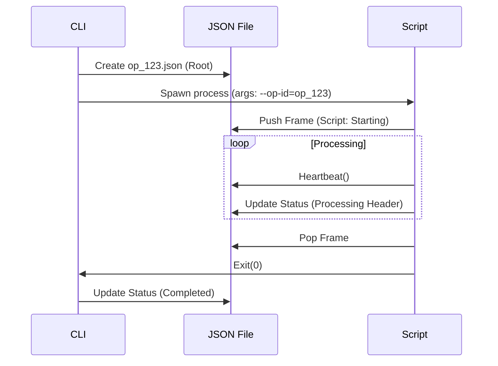
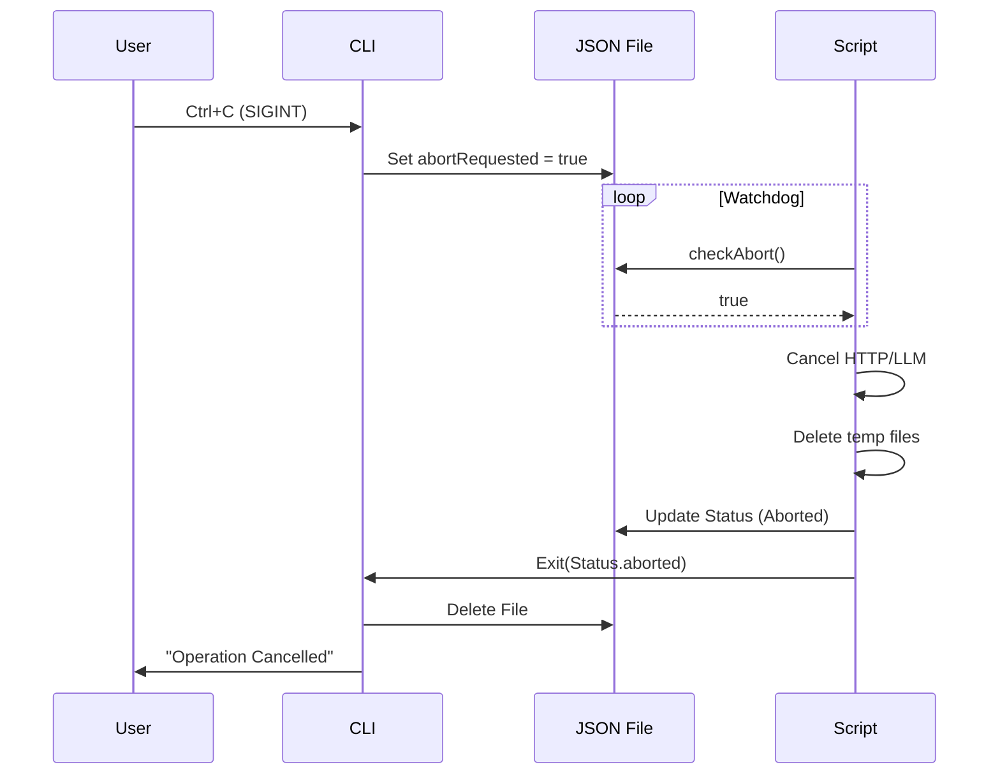
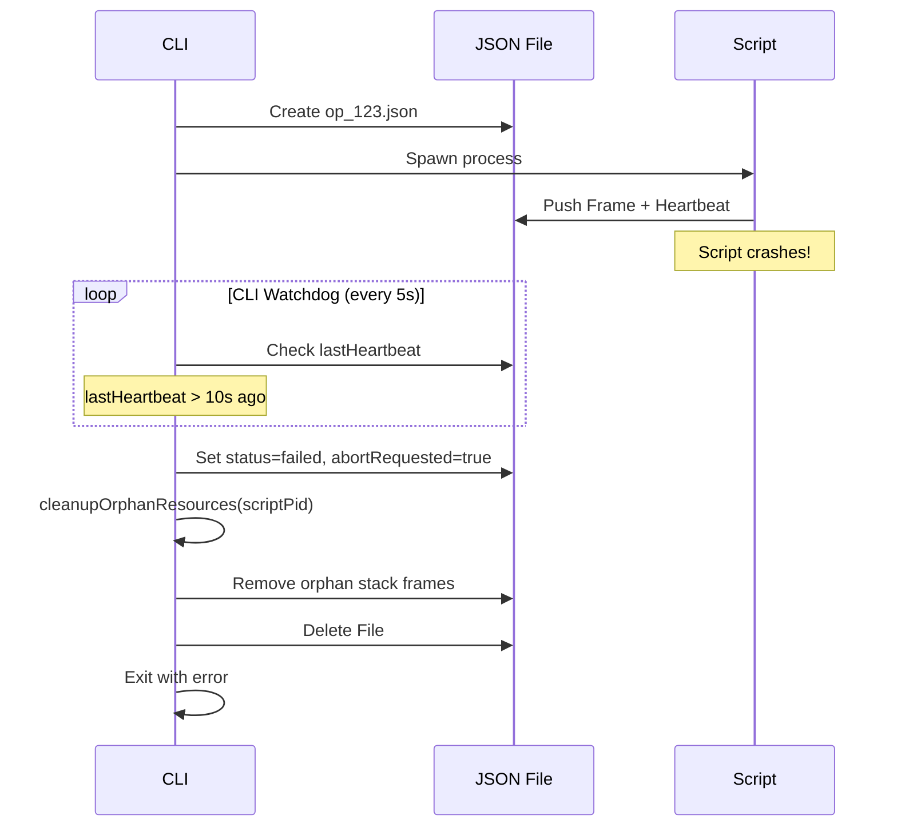
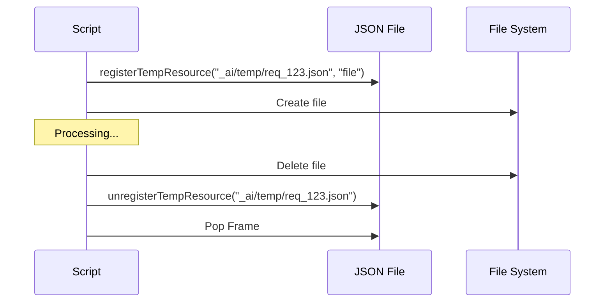

# Distributed Operation Ledger: Shared State Architecture

**Package:** tom_dist_ledger  
**Date:** 2026-01-18  
**Status:** Implemented  

## Terminology

| Term | Definition |
|------|------------|
| **Operation** | The complete flow of work from start to finish, initiated by a single initiator. |
| **Participant** | Any process or daemon that can receive and execute calls within an operation. |
| **Initiator** | The participant that starts an operation and registers it in the Ledger. |
| **Call** (or Step) | A single unit of work requested from one participant to another. |
| **Supervisor** | A daemon/server/bridge that manages concurrent calls and performs cleanup. |
| **Daemon** | A long-running process that receives calls without spawning new processes. |

## Current Limitations

- Operations run on a **single machine** with all participants having access to the shared filesystem.
- All participants (including the initiator) must be able to read/write the Ledger files.

## Daemon & Supervisor Responsibilities

Daemons (like the DartScript Bridge or VS Code Extension Host) act as **supervisors** for:

1. All calls currently executing within them.
2. All operations they have initiated.

**Supervisor Duties:**

- Maintain heartbeat for all concurrent calls.
- Register each call internally to detect stuck calls.
- Perform cleanup when a call times out or fails.

**Call Registration:**

- When a call does **not** spawn a new process (daemon-to-daemon), there is no process ID.
- The call is registered with a unique `callId` instead of a `pid`.
- The supervisor tracks all active `callId`s and their start times.

**Process Spawning:**

- When a call **does** spawn a new process, the initiator has the `pid` and can forcefully kill it.

## The Challenge

The Tom ecosystem involves a complex, multi-process execution chain that spans across different contexts:

- **Context A:** Local Terminal (Tom CLI) - *Process ID 111*
- **Context B:** VS Code Extension Host (DartScript Bridge) - *Process ID 222*
- **Context C:** VS Code Extension (Tom Extension) - *Process ID 222*
- **Context D:** AI Agent / Script (Generated Code) - *Process ID 333*

**Problem 1: No Shared Signal Space**
Standard OS signals (`SIGINT` from Ctrl+C) do not propagate across RPC boundaries or the DartScript bridge naturally. If a user cancels a CLI command, the VS Code extension and any spawned scripts may continue running as "zombies."

**Problem 2: Opaque Execution State**
When a long-running operation is "working," it is difficult to know *which* part of the distributed system is currently active. Is it waiting for the CLI? Is the Extension polling the LLM? Is a script stuck in a loop?

## External Calls

Some calls cannot be tracked in the Ledger because they involve external systems:

- **Copilot Chat:** The AI agent is invoked via VS Code APIs. We cannot track its internal state.
- **Web Resources:** HTTP calls to external APIs.

For external calls, failure is detected by:

1. Polling for a result (e.g., answer file).
2. Timing out after a defined duration.

The calling participant is responsible for setting a timeout and handling the failure.

## The Solution: A Shared Operation Ledger

We propose a filesystem-based **Distributed Processing Ledger (DPL)** that acts as the "nervous system" connecting these detached processes. It uses a shared state machine (JSON files) where any actor can update its status or check for cancellation signals.

### 1. Architecture

**Location:** `_ai/ops_ledger/` (Gitignored folder)

**File Naming:** `<operation_id>.json` (e.g., `op_20260118_120000_a1b2.json`)

**Data Structure:**

```json
{
  "operationId": "op_20260118_120000_a1b2",
  "rootPid": 1234,             // PID of the initiator (CLI)
  "startTime": "2026-01-18T12:00:00Z",
  "status": "active",          // active, completed, failed, aborted
  "abortRequested": false,     // The global kill switch
  "lastHeartbeat": "2026-01-18T12:00:05Z", // Dead man's switch
  
  // The Distributed Stack Trace
  "stack": [
    { 
      "layer": "cli", 
      "pid": 1234, 
      "status": "waiting_for_bridge", 
      "description": "tom doc generate --target=overview.md" 
    },
    { 
      "layer": "bridge", 
      "pid": 5678, 
      "status": "executing_script", 
      "description": "Script: process_doc.dart" 
    },
    { 
      "layer": "script", 
      "pid": 9012, 
      "status": "polling_llm", 
      "description": "Processing section 'Overview'",
      "resources": ["_ai/chat_replies/req_8899_answer.json"] 
    }
  ]
}
```

### 2. Core Mechanisms

#### A. Registration & Stack Management

**Stack Ownership:** Each participant is responsible for its own stack frame lifecycle.

- **Push:** A spawned process adds its own entry to the stack immediately after joining.
- **Pop:** A process removes its own entry when it completes (success or failure).
- **Verification:** The parent must verify the child's frame was created within 10 seconds.

**Verification via Heartbeat:**

The heartbeat loop is the single mechanism for all liveness checks:

1. **Self:** Update `lastHeartbeat` timestamp.
2. **Children:** Verify expected child frames exist in the stack.
3. **Abort:** Check `abortRequested` flag.
4. **Liveness:** Check if `lastHeartbeat` is stale (>10s).

If any check fails, initiate cleanup and abort.

When a process starts work, it **locks** the ledger file, appends its entry to the `stack` array, and updates the file.

- **CLI:** Creates the file as Root.
- **Bridge/Script:** Reads ID from args, adds entry, updates status.

**Stack Frame Description Conventions:**

Descriptions must be concise summary strings, not full dumps.

- **CLI:** Command name + key flags (max 50 chars). *Example:* `tom doc generate --target=overview.md`
- **Bridge:** Action name. *Example:* `Run Script: process_doc.dart`
- **Script:** Script name + Current Task/Section. *Example:* `process_doc.dart (Overview)`
- **Bot:** Request ID + Model. *Example:* `Req 8899 (GPT-4)`

#### B. Heartbeat Protocol

**All participants must send heartbeats** to prove liveness. The heartbeat loop is the **single checkpoint** for all distributed coordination.

**Timing Rules:**

- **Interval:** Between 4 and 5 seconds, with random jitter.
- **Jitter:** Each heartbeat schedules the next with a random delay in range `[4000ms, 5000ms]`.
- **Timeout:** If no heartbeat is received for **10 seconds**, the operation is considered dead.

**Heartbeat Responsibilities (performed each cycle):**

1. **Update Timestamp:** Write current time to `lastHeartbeat`.
2. **Check Liveness:** If `lastHeartbeat` is older than 10s, trigger abort.
3. **Check Abort Flag:** If `abortRequested` is true, initiate cleanup and exit.
4. **Verify Children:** If waiting for a spawned child, check if its stack frame exists.
5. **Verify Parent:** If parent's frame disappeared unexpectedly, assume orphaned and exit.

**Detection & Response:**

1. Any participant detecting a failure condition MUST:
   - Set `status: "failed"` and `abortRequested: true`.
   - Perform cleanup of registered temporary resources.
   - Exit with an error.
2. The Root process (CLI) is the final authority for orphan cleanup.

**Heartbeat Update:**
Each participant updates the global `lastHeartbeat` field. This means the "freshest" heartbeat wins, ensuring at least one active process keeps the operation alive.

#### C. Temporary Resource Registration

Before creating temporary files or folders, they **must be registered** in the ledger. This ensures cleanup even after crashes.

**Data Structure Extension:**

```json
{
  "operationId": "...",
  "tempResources": [
    { "type": "file", "path": "_ai/chat_replies/req_123.json", "owner": 9012 },
    { "type": "dir", "path": "_ai/temp/gen_456/", "owner": 9012 }
  ]
}
```

**Rules:**

1. **Register Before Create:** Call `registerTempResource(path, type)` before `File.create()`.
2. **Unregister After Delete:** Call `unregisterTempResource(path)` after successful deletion.
3. **Directories:** May only contain temporary files. Subdirectories are not permitted.
4. **Cleanup Order:** Files first, then directories.
5. **Owner Tracking:** The `owner` field stores the PID of the creating process.

#### D. Concurrency Control (Locking)

To prevent race conditions when multiple processes update the JSON:

1. **Mechanism:** Use a dedicated lock file: `<operation_id>.json.lock`.
2. **Algorithm:**
   - Try to create `.lock` file (exclusive mode).
   - If exists, wait/retry (max 1s).
   - If created: Read JSON → Modify → Write JSON → Delete `.lock`.
3. **Fail-safe:** If `.lock` is > 2 seconds old, assume owner died and force delete.

#### E. Interrupt Propagation

1. **Trigger:** User hits `Ctrl+C` (CLI) or runs `stop-op` (Tool).
2. **Action:** Sets `"abortRequested": true` in JSON.
3. **Reaction:** All components check this flag in their `watchdog()` loop.
   - True? → Cancel work, clean up, write `.aborted` tombstone, exit.

#### F. Cleanup Verification

Cleanup is a critical path. It must be verified, not assumed.

**Rules:**

1. **Self-Cleanup:** Each process cleans up its own `tempResources` before popping its frame.
2. **Parent Verification:** After a child process exits, the parent checks:
   - Is the child's stack frame removed?
   - Are the child's `tempResources` (by `owner` PID) deleted?
3. **Orphan Cleanup:** If verification fails, the parent performs cleanup on behalf of the child.
4. **Root Finalization:** The Root process (CLI) deletes the ledger file itself.

### 3. DPL API Specification

We define a standard API to be implemented in **Dart** (`tom_dpl_client`) and **TypeScript** (`tom-dpl-client-js`).

#### Core Interface

```typescript
interface DPLClient {
  // Initialization
  startOperation(descriptor: OpDescriptor): Promise<string>;  // Returns opId
  joinOperation(opId: string, descriptor: OpDescriptor): Promise<void>;

  // State Management
  updateStatus(status: string, description?: string): Promise<void>;
  
  // Heartbeat (call every 4-5s with jitter)
  heartbeat(): Promise<void>;
  startHeartbeatTimer(): void;   // Starts background heartbeat loop
  stopHeartbeatTimer(): void;    // Stops background heartbeat loop
  
  // Dead Process Detection
  checkLiveness(): Promise<boolean>;  // Returns false if lastHeartbeat > 10s ago
  verifyChildExists(childPid: number): Promise<boolean>;  // Check if child frame exists in stack

  // Stack Management
  pushFrame(frame: StackFrame): Promise<void>;
  popFrame(): Promise<void>;
  verifyChildCleanup(childPid: number): Promise<boolean>;  // Check if child cleaned up

  // Temporary Resource Management
  registerTempResource(path: string, type: 'file' | 'dir'): Promise<void>;
  unregisterTempResource(path: string): Promise<void>;
  cleanupOwnResources(): Promise<void>;       // Delete own temp resources
  cleanupOrphanResources(pid: number): Promise<void>;  // Delete resources by owner PID

  // Coordination
  requestAbort(opId: string): Promise<void>;
  checkAbort(): Promise<boolean>;  // Throws AbortException if true
  
  // Cleanup
  complete(status: 'success' | 'failed'): Promise<void>;
}

interface OpDescriptor {
  layer: 'cli' | 'bridge' | 'script' | 'bot';
  pid: number;
  description: string;
}

interface StackFrame {
  layer: string;
  pid: number;
  status: string;
  description: string;
  resources?: string[];
}
```

#### Heartbeat Timer Implementation

```typescript
// Pseudocode for heartbeat with jitter
class HeartbeatTimer {
  private timer: NodeJS.Timeout | null = null;
  private expectedChildPid: number | null = null;
  private childSpawnTime: Date | null = null;
  
  start(client: DPLClient): void {
    const scheduleNext = async () => {
      // 1. Update own heartbeat
      await client.heartbeat();
      
      // 2. Check liveness (stale heartbeat)
      if (!await client.checkLiveness()) {
        await client.requestAbort(client.opId);
        return; // Stop heartbeat, initiate cleanup
      }
      
      // 3. Check abort flag
      if (await client.checkAbort()) {
        return; // Stop heartbeat, cleanup triggered
      }
      
      // 4. Verify child frame exists (if waiting for child)
      if (this.expectedChildPid && this.childSpawnTime) {
        const elapsed = Date.now() - this.childSpawnTime.getTime();
        if (elapsed > 10000) {
          const childExists = await client.verifyChildExists(this.expectedChildPid);
          if (!childExists) {
            console.error('Child process failed to register within 10s');
            await client.requestAbort(client.opId);
            return;
          }
        }
      }
      
      // Random jitter between 4000ms and 5000ms
      const delay = 4000 + Math.random() * 1000;
      this.timer = setTimeout(scheduleNext, delay);
    };
    scheduleNext();
  }
  
  expectChild(pid: number): void {
    this.expectedChildPid = pid;
    this.childSpawnTime = new Date();
  }
  
  childConfirmed(): void {
    this.expectedChildPid = null;
    this.childSpawnTime = null;
  }
  
  stop(): void {
    if (this.timer) clearTimeout(this.timer);
  }
}
```

#### Flow Diagram: Happy Path



#### Flow Diagram: Cancellation



#### Flow Diagram: Dead Process Detection



#### Flow Diagram: Temp Resource Lifecycle



### 4. Implementation Plan

#### Phase 1: Script Support (Immediate)

Implement the ledger client in `tom_scripts` (e.g., `process_doc.dart`).

- Allow scripts to accept an `--op-id` argument.
- If no ID is provided, create a new Ledger (act as Root).
- Implement the heartbeat timer with 4-5s jitter.
- Implement temp resource registration before file creation.
- Implement the `watchdog()` loop to check for `abortRequested` and liveness.

#### Phase 2: CLI Integration

Update `tom_cli` to:

- Generate `op_id` for all commands.
- Pass `op_id` to the DartScript Bridge client.
- Implement `SIGINT` trapping to write into the ledger.
- Implement parent verification of child cleanup.

#### Phase 3: Bridge & Extension

Update `tom_dartscript_bridge`:

- Accept `op_id` in the protocol.
- Forward `op_id` to spawned scripts.
- Implement Bridge-level watchdog to cancel VS Code `CancellationToken`s if the ledger aborts.

#### Phase 4: Visualization

Create a `tom ps` command that:

- Scans `_ai/ops_ledger/*.json`.
- Displays a tree view of running distributed operations.
- Allows `tom kill <op_id>` to set the abort flag manually (for zombie cleanup).

### 5. Benefits

1. **Observability:** See what the entire distributed system is doing via `_ai/ops_ledger/`.
2. **Reliability:** No more orphaned "zombie" processes eating up API tokens or CPU.
3. **Responsiveness:** User cancellation works instantly across the entire chain.
4. **Debuggability:** JSON file provides a snapshot of the last known state and stack trace.
5. **Guaranteed Cleanup:** Temp resources are always cleaned up, even after crashes.
